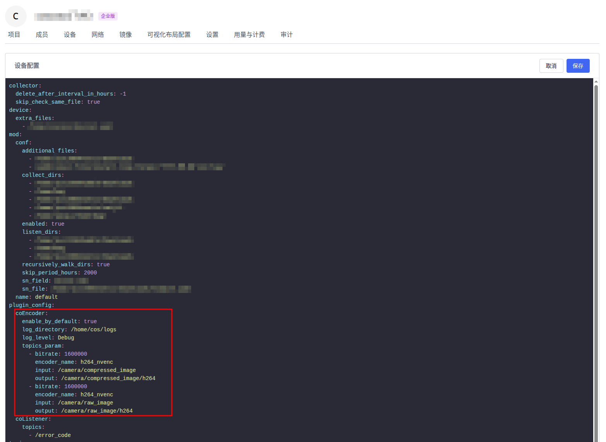

# coEncoder

## Prerequisite

- Have ROS on your system

- Install dependencies
```bash
sudo apt install libavcodec-dev libavutil-dev libopencv-dev libcurl4 ros-${ROS_DISTRO}-foxglove-msgs -y
```
## GPU Support
coencoder supports hardware-accelerated encoding using the following encoders:
```C++
"h264_nvenc",    // NVIDIA NVENC
"h264_qsv",      // Intel Quick Sync
"h264_amf",      // AMD VCE
"h264_vaapi",    // VAAPI (Linux hardware acceleration)
```

## Configuration

If the system environment variable contains `HOME`, the config file is located at `$HOME/.config/coencoder/config.json`, otherwise, the config file is located at `/tmp/coencoder/config/config.json`. If you start coEncoder using `rosrun` (or `ros2 run`), you can use --config-file to specify the config file path.

```Json
{
  "enable_by_default": true,
  "log_directory": "/home/cos/logs",
  "log_level": "Debug",
  "topics_param": [
    {
      "bitrate": 1600000,
      "encoder_name": "h264_nvenc",
      "input": "/camera_0/raw_image",
      "output": "/camera_0/raw_image/h264",
      "output_frame_rate": 10,
      "encode_preset": "ultrafast",
      "encode_tune": "zerolatency"
    },
    {
      "bitrate": 1600000,
      "encoder_name": "libx264",
      "input": "/camera_1/raw_image",
      "output": "/camera_1/raw_image/h264",
      "output_frame_rate": 15,
      "encode_preset": "ultrafast",
      "encode_tune": "zerolatency"
    }
  ]
}
```
* **enable_by_default**: Whether to enable encoding by default
* **log_directory**: Log file path
* **log_level**: Log level, possible values: Debug / Info / Warn / Error
* **topics_param**: Array type, contains 7 fields
  * **bitrate**: Output bitrate
  * **input**: Input topic name
  * **output**: Output topic name
  * **[optional param] encoder_name**: Encoder name, supports `h264_nvenc`, `h264_qsv`, `h264_amf`, `h264_vaapi`, and you can also use `libx264` to encode frames by CPU. (`libx264` for default)
  * **[optional param] output_frame_rate**: output frame rate (0 for default, use original framerate)
  * **[optional param] encode_preset**:
  
    | valid value                | encode speed      | CPU usage      | quality/encode rate           |
    |:---------------------------|:------------------|:---------------|:------------------------------|
    | **ultrafast**  *(default)* | 🚀 ultrafast      | 🟢 lowest      | 🔴 worst (highest bitrate)    |
    | **superfast**              | 🚀 very fast      | 🟢 very low    | 🔴 very poor                  |
    | **veryfast**               | ⚡ fast            | 🟢 low         | 🟠 slightly poor              |
    | **faster**                 | fast              | 🟡 medium-low  | 🟡 average                    |
    | **fast**                   | medium-fast       | 🟡 medium      | 🟢 acceptable                 |
    | **medium**                 | balanced          | 🟠 medium-high | 🟢 recommended default        |
    | **slow**                   | slow              | 🔴 high        | 🟢 good                       |
    | **slower**                 | slower            | 🔴 high        | 🟢 better                     |
    | **veryslow**               | very slow         | 🔴 highest     | 🟢 best compression           |
    | **placebo**                | 💀 extremely slow | 🔴 very high   | 🟢 minimal additional benefit |
  
  * **[optional param] encode_tune**:
  
    | Tune                        | Purpose                                                            | CPU usage               |
    |:----------------------------|:-------------------------------------------------------------------|:------------------------|
    | **film**                    | For high-quality film material (preserve details, noise reduction) | 🔴 slightly higher      |
    | **animation**               | For animation (sharpen edges)                                      | 🔴 slightly higher      |
    | **grain**                   | Preserve film grain (high complexity)                              | 🔴 significantly higher |
    | **stillimage**              | For static images                                                  | 🟡 moderate             |
    | **psnr / ssim**             | For quality testing (not recommended)                              | 🔴 slightly higher      |
    | **fastdecode**              | For fast decoding (reduce B-frames etc.)                           | 🟢 lower                |
    | **zerolatency** *(default)* | Low latency real-time transmission (remove buffering)              | 🟢 lower                |


## Online Configuration Modification
**Online configuration modification requires coScout v1.1.8 or later**
* Online configuration editing
  * Organization Settings -> Devices -> Device Configuration  

    
  * Edit fields
  
    
  In device configuration, add the `coEncoder` field as shown in the image above. Note that `coEncoder` is a sub-field of `plugin_config`.
  * Configuration validity
    * The configuration MUST contain the `topics_param` field, and this field must be of array type.
    * Elements in `topics_param` MUST have three fields: `input`, `output`, `bitrate`. `input` and `output` are strings, `bitrate` is an integer.
    * `output_frame_rate`, `encoder_name`, `encode_preset` and `encode_tune` fields are optional. If these fields are not explicitly specified in `topics_param`, coEncoder will use default values for h264 encoding

## Compile OR deb install

**You can install CoEncoder by compiling it yourself or by using the provided .deb package.**
- Compile 
  - ROS1
    ```bash
    # Copy the project into your ROS workspace
    cp -r ${THIS_REPO} ${YOUR_ROS_WS}/src/
    
    # Source ROS setup and build
    source /opt/ros/${ROS_DISTRO}/setup.bash
  
    cd ${YOUR_ROS_WS}
  
    catkin_make --pkg coencoder install
    ```
  - ROS2
    ```bash
    # Copy the project into your ROS workspace
    cp -r ${THIS_REPO} ${YOUR_ROS_WS}/src/
    # Source ROS setup and build
    source /opt/ros/${ROS_DISTRO}/setup.bash
  
    cd ${YOUR_ROS_WS}
    colcon build --packages-select coencoder    
    ```
    
- deb Install
  ```bash
    dpkg -i ros-${ROS_DISTRO}-coencoder_latest_$(dpkg --print-architecture).deb
  ```

## RUN

- ROS1
  ```bash
  # if install coencoder by Compile, source your workspace  
  source ${YOUR_ROS_WS}/install/setup.bash
  # if install coencoder by deb, source ros
  source /opt/ros/${ROS_DISTRO}/setup.bash
  
  roslaunch coencoder coencoder.launch
  # You can also use `rosrun` to start the node
  rosrun coencoder coencoder --config-file ${CONFIG_FILE_PATH}
  ```
  
- ROS2
  ```bash
  # if install coencoder by Compile, source your workspace  
  source ${YOUR_ROS_WS}/install/setup.bash
  # if install coencoder by deb, source ros
  source /opt/ros/${ROS_DISTRO}/setup.bash
  
  ros2 launch coencoder coencoder_launch.xml
  # You can also use `ros2 run` to start the node  
  ros2 run coencoder coencoder -- --config-file ${CONFIG_FILE_PATH}
  ```
